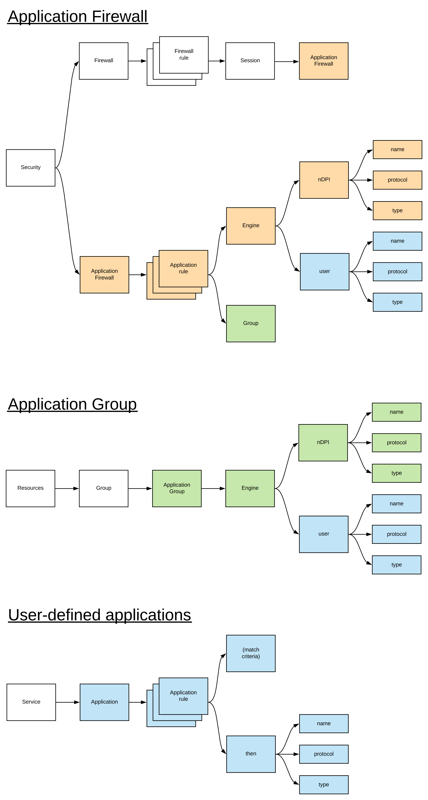

# Hướng dẫn cấu hình Deep Packet Inspection trong vRouterOS

## Giới thiệu

**Deep Packet Inspection (DPI)** trong **vRouterOS** là một tính năng cho phép phân tích chi tiết nội dung các gói tin mạng để phân loại lưu lượng dựa trên giao thức ứng dụng (application protocol) hoặc đặc điểm cụ thể (như HTTP, FTP, DNS). DPI giúp:
- Xác định loại lưu lượng (ví dụ: YouTube, Skype, BitTorrent).
- Áp dụng các chính sách QoS, tường lửa, hoặc giám sát dựa trên loại lưu lượng.
- Theo dõi thống kê lưu lượng theo ứng dụng.

Tài liệu này hướng dẫn cách kích hoạt DPI, cấu hình phân loại lưu lượng, áp dụng DPI vào giao diện, và giám sát kết quả. Các lệnh được thực thi trong **chế độ vận hành** (ký hiệu `$`) hoặc **chế độ cấu hình** (ký hiệu `#`). Các thay đổi cần được **commit** để có hiệu lực và **lưu** để duy trì sau khi khởi động lại.

## Tổng quan về DPI

- **Chức năng DPI**: Phân tích các gói tin ở tầng ứng dụng (Layer 7) để nhận diện giao thức hoặc ứng dụng, vượt qua khả năng của tường lửa truyền thống (chỉ dựa trên IP/cổng).
- **Ứng dụng**:
  - Phân loại lưu lượng cho QoS (ưu tiên ứng dụng như VOIP).
  - Áp dụng chính sách tường lửa dựa trên ứng dụng.
  - Giám sát lưu lượng để phân tích hiệu suất hoặc bảo mật.
- **Yêu cầu**: DPI yêu cầu tài nguyên CPU đáng kể, vì vậy cần giám sát tải hệ thống khi kích hoạt.



## Các lệnh cấu hình DPI

### 1. Kích hoạt DPI trên giao diện
- **Mô tả**: Kích hoạt DPI để phân tích lưu lượng trên một giao diện cụ thể.
- **Lệnh**:
  ```
  # set interfaces dataplane <interface> dpi enable
  ```
  - `<interface>`: Tên giao diện (ví dụ: `dp0s3`).
- **Ví dụ**:
  ```
  $ configure
  # set interfaces dataplane dp0s3 dpi enable
  # commit
  # save
  Saving configuration to '/config/config.boot'...
  Done
  ```
  - Kích hoạt DPI trên giao diện `dp0s3`.

### 2. Cấu hình phân loại lưu lượng DPI
- **Mô tả**: Tạo một chính sách DPI để phân loại lưu lượng theo ứng dụng hoặc giao thức.
- **Lệnh**:
  ```
  # set dpi policy <policy-name> rule <rule-number> application <app-name>
  # set dpi policy <policy-name> rule <rule-number> action <action>
  ```
  - `<policy-name>`: Tên chính sách DPI.
  - `<rule-number>`: Số thứ tự quy tắc (1, 2, 3,...).
  - `<app-name>`: Tên ứng dụng hoặc giao thức (ví dụ: `http`, `youtube`, `skype`).
  - `<action>`: Hành động như `mark`, `drop`, hoặc `accept`.
- **Ví dụ**:
  ```
  # set dpi policy APP_CONTROL rule 10 application youtube
  # set dpi policy APP_CONTROL rule 10 action mark 10
  # set dpi policy APP_CONTROL rule 20 application skype
  # set dpi policy APP_CONTROL rule 20 action drop
  # commit
  ```
  - Quy tắc 10: Đánh dấu lưu lượng YouTube với giá trị 10 (dùng cho QoS hoặc tường lửa).
  - Quy tắc 20: Từ chối lưu lượng Skype.

### 3. Áp dụng chính sách DPI vào giao diện
- **Mô tả**: Gắn chính sách DPI vào giao diện để xử lý lưu lượng.
- **Lệnh**:
  ```
  # set interfaces dataplane <interface> dpi policy <policy-name>
  ```
- **Ví dụ**:
  ```
  # set interfaces dataplane dp0s3 dpi policy APP_CONTROL
  # commit
  # save
  Saving configuration to '/config/config.boot'...
  Done
  ```
  - Áp dụng chính sách `APP_CONTROL` cho giao diện `dp0s3`.

### 4. Tích hợp DPI với QoS hoặc tường lửa
- **Mô tả**: Sử dụng kết quả phân loại DPI (như giá trị `mark`) để áp dụng chính sách QoS hoặc tường lửa.
- **Lệnh** (Ví dụ với QoS):
  ```
  # set qos policy QOS_DPI rule 10 match mark 10
  # set qos policy QOS_DPI rule 10 bandwidth 5mbit
  # set interfaces dataplane dp0s3 qos QOS_DPI
  ```
- **Ví dụ**:
  ```
  $ configure
  # set dpi policy APP_CONTROL rule 10 application youtube
  # set dpi policy APP_CONTROL rule 10 action mark 10
  # set interfaces dataplane dp0s3 dpi policy APP_CONTROL
  # set qos policy QOS_DPI rule 10 match mark 10
  # set qos policy QOS_DPI rule 10 bandwidth 5mbit
  # set interfaces dataplane dp0s3 qos QOS_DPI
  # commit
  # save
  ```
  - Đánh dấu lưu lượng YouTube và giới hạn băng thông ở 5 Mbit/s.

### 5. Kiểm tra cấu hình DPI
- **Mô tả**: Xem cấu hình DPI hiện tại.
- **Lệnh**:
  - Trong chế độ cấu hình:
    ```
    # show dpi
    ```
  - Trong chế độ vận hành:
    ```
    $ show dpi
    $ show dpi policy <policy-name>
    ```
- **Ví dụ**:
  ```
  # show dpi
  policy APP_CONTROL {
      rule 10 {
          application youtube
          action mark 10
      }
      rule 20 {
          application skype
          action drop
      }
  }
  interfaces {
      dataplane dp0s3 {
          dpi {
              enable
              policy APP_CONTROL
          }
      }
  }
  ```

### 6. Kiểm tra trạng thái DPI
- **Mô tả**: Hiển thị thống kê DPI, bao gồm số gói tin và byte khớp với các ứng dụng.
- **Lệnh**:
  ```
  $ show dpi statistics
  $ show dpi policy <policy-name> statistics
  ```
- **Ví dụ**:
  ```
  $ show dpi policy APP_CONTROL statistics
  Rule    Application    Packets    Bytes    Action
  ----    -----------    -------    -----    ------
  10      youtube        5000       400000   MARK 10
  20      skype          2000       160000   DROP
  ```
  - Cho biết lưu lượng YouTube và Skype được phân loại và xử lý.

### 7. Xóa cấu hình DPI
- **Mô tả**: Xóa chính sách DPI hoặc tắt DPI trên giao diện.
- **Lệnh**:
  ```
  # delete dpi policy <policy-name> rule <rule-number>
  # delete dpi policy <policy-name>
  # delete interfaces dataplane <interface> dpi
  ```
- **Ví dụ**:
  ```
  $ configure
  # delete dpi policy APP_CONTROL rule 10
  # commit
  # save
  ```
  - Xóa quy tắc 10 trong chính sách `APP_CONTROL`.
  ```
  # delete interfaces dataplane dp0s3 dpi
  # commit
  # save
  ```
  - Tắt DPI trên giao diện `dp0s3`.

### 8. So sánh và hủy bỏ thay đổi
- **So sánh cấu hình**:
  ```
  #